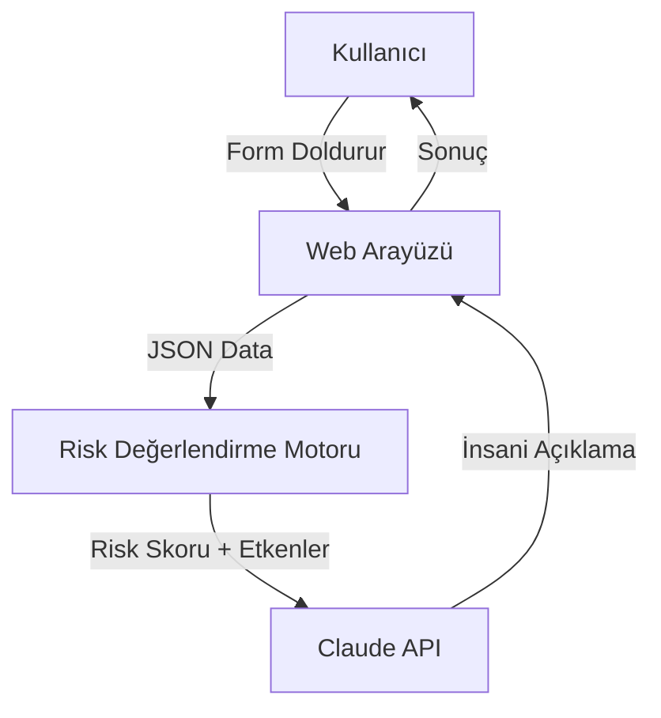

# Sağlık Risk Değerlendirme Asistanı - Mimari Plan

## Proje Özeti
Kullanıcıdan 5 temel soru alarak sağlık riskini değerlendiren, iki aşamalı AI sistemi kullanan web uygulaması.

---

## Sistem Mimarisi



---

## Bileşenler

### 1. Frontend (HTML/CSS/JS)
- **5 Soruluk Form:**
  1. Yaş (sayı input)
  2. Ateş var mı? (evet/hayır)
  3. Öksürük süresi (gün cinsinden)
  4. Nefes darlığı var mı? (evet/hayır)
  5. Kronik hastalık var mı? (evet/hayır)

- **Sonuç Ekranı:**
  - Risk seviyesi badge (düşük/orta/yüksek)
  - Claude tarafından üretilen açıklama
  - Yasal uyarı (tıbbi tavsiye değildir)

### 2. Risk Değerlendirme Motoru (Makine Öğrenimi Modeli)

**Model Türü:** Basit Karar Ağacı / Lojistik Regresyon benzeri örüntü tanıma

**Eğitim Verisi:** Önceden tanımlanmış örnek vakalar (synthetic dataset)

**Öğrenilen Örüntüler:**
```javascript
// Model örnek verilerden şu kuralları öğrenir:
// - Ateş + nefes darlığı kombinasyonu = yüksek risk
// - Yaş > 60 + herhangi belirti = orta-yüksek risk
// - Genç yaş + tek belirti = düşük risk
// - Kronik hastalık + ateş = yüksek risk
// - Öksürük > 7 gün = risk artışı
```

**Model Çıktısı:**
```javascript
{
  riskScore: 72,        // 0-100 arası skor
  riskLevel: "orta",    // "düşük" | "orta" | "yüksek"
  factors: [            // Risk etkenleri listesi
    "yaş: 65 (ileri yaş)",
    "ateş: var",
    "nefes darlığı: yok (olumlu)"
  ],
  confidence: 0.85      // Model güven skoru
}
```

**Client-Side ML:** TensorFlow.js veya basit karar ağacı implementasyonu ile tarayıcıda çalışır (veri gizliliği için).

### 3. Claude Entegrasyonu
**Prompt Yapısı:**
```
Sen bir sağlık asistanısın. Aşağıdaki risk değerlendirme sonucunu 
hasta için anlaşılır bir dille açıkla. Teşhis koyma, sadece 
açıklayıcı ve yönlendirici ol.

Risk Seviyesi: {SEVIYE}
Etkenler: {ETKEN_LISTESI}

Kurallar:
- Empatik ve sakin bir dil kullan
- Risk faktörlerini tek tek açıkla
- Olumlu faktörleri de belirt
- Belirtiler devam ederse doktora gitmesini öner
- Tıbbi tavsiye vermediğini ima et
```

---

## Dosya Yapısı

```
saglik_projesi/
├── index.html              # Ana sayfa + form
├── css/
│   └── style.css           # Stil dosyası
├── js/
│   ├── riskModel.js        # ML tabanlı risk modeli
│   ├── trainingData.js     # Model eğitim verileri
│   ├── claudeService.js    # Claude API entegrasyonu
│   └── app.js              # Ana uygulama mantığı
└── plans/
    └── saglik_risk_degerlendirme_plani.md  # Bu dosya
```

---

## Teknoloji Stack

- **Frontend:** Vanilla HTML/CSS/JS (basitlik için)
- **AI Model:** Claude API (açıklama üretimi)
- **Risk Motor:** Client-side JavaScript (gizlilik için)

---

## Önemli Notlar

1. **Etik Gereklilikler:**
   - Sistem doktor değildir uyarısı
   - Acil durumlarda 112'yi arayın mesajı
   - Veriler cihazda kalır (gizlilik)

2. **Jüri Değerlendirme Kriterleri:**
   - İki aşamalı AI kullanımı (risk motoru + Claude)
   - Kullanıcı deneyimi
   - Etik ve yasal uyarılar
   - Kod kalitesi ve organizasyonu

---

## Uygulama Adımları

1. HTML form yapısını oluştur
2. CSS ile modern, erişilebilir tasarım
3. Risk hesaplama algoritmasını implemente et
4. Claude API entegrasyonunu ekle
5. Test ve iyileştirme
